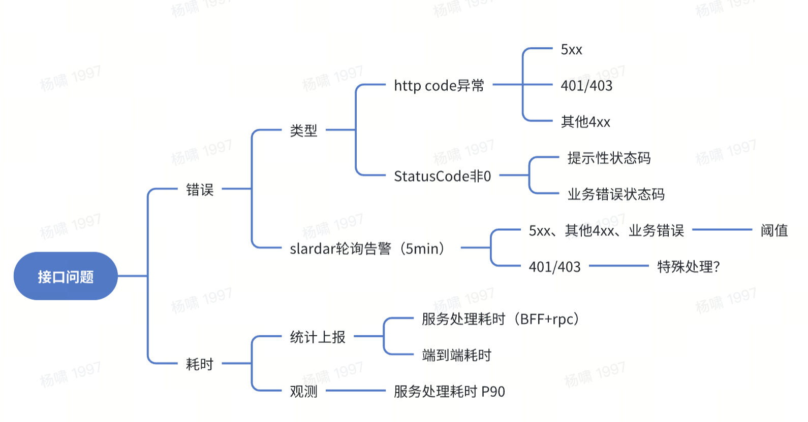

# VoC项目

## 1 项目简介
- **基于什么来做：** 月均 2400万 的用户反馈原声，以及相关的业务数据（比如客服工单、用户画像、订单属性等）、行为数据（端内用户行为）；
- **做什么样的事情：** 从问题发现到问题解决的⼀体化⽤户体验中台；
- **有什么样的价值：** 从通用产品用户体验的普适提升，到识别和解决高价值精细化问题，从而提高用户粘性，为业务发展保驾护航；

**VoC 主要服务两个人群：**
* 运营（用服）：最初他们希望通过全面的客服兜底能力，完成对用户的服务支持，但后续发现**真的找到平台的用户，还是非常小的一部分**。他们希望前置进一步前置，希望可以提前发现问题。**核心就是拿召回率**的结果。主要涉及数据接入&问题研判链路。

* 质量人员：通过监测百万DAU BUG反馈基线指标(BUG类反馈数-突发事故反馈数/百万DAU)，拆解其中的TOP顽疾问题，开展专项优化。

## 2 项目难点

### 2.1 整体维度
* 数据接入：

### 2.2 前端

1. 各个业务线&数据源在业务形态上差异很大，有很多定制化的需求需要区分配置。

- 公共组件基于semi UI开发，有三个封装层级，高级可由低级组成：
  - components - 业务无关的组件；
  - blocks - 封装了业务逻辑与请求的粒度较大的组件，对应业务模型中的原子功能；
  - modules - 业务功能模块，封装了完整的业务流程，粒度通常为页面级别；

2. 标签树逻辑

# 3 技术方面

## 3.1 前端监控
  错误上报主要分为两类： 1. 利用slardar兜底多级，errorbounday捕获到的JS error，二是代码中手动上报的logger（前端逻辑错误、重点流程错误）

  
  

## 3.2 前端性能优化

## 3.3 BI（hilbert查询链路）

